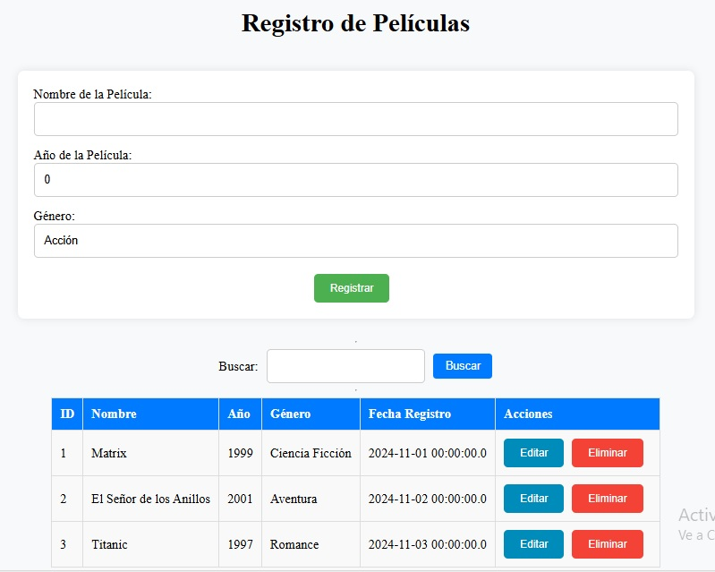
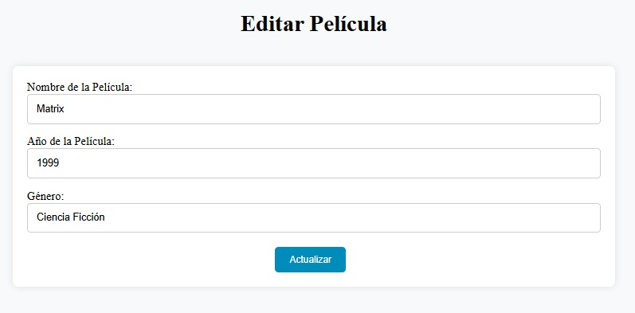

# Gestión de Películas 🎬

Este proyecto es una aplicación de gestión de películas desarrollada con **JavaServer Faces (JSF)** y **Hibernate**. Permite realizar operaciones CRUD (Crear, Leer, Actualizar y Eliminar) sobre las películas y sus géneros asociados.

## Funcionalidades
- Registro de nuevas películas.
- Selección de géneros desde un menú desplegable.
- Listado de películas con detalles.
- Edición y eliminación de registros.
- Persistencia de datos gestionada con **Hibernate**.

## Capturas de Pantalla
### Formulario de Registro

### Edición de Películas

## Tecnologías Utilizadas
- **JSF** (JavaServer Faces) para la interfaz de usuario.
- **Hibernate** como ORM para gestionar la persistencia de datos.
- **Java** para la lógica del backend.
- **CSS** para el diseño responsivo y estilización.
- **MYSQL** para la base de datos.
- **Netbean 8.0.2**
- **GlassFish 4.1**

